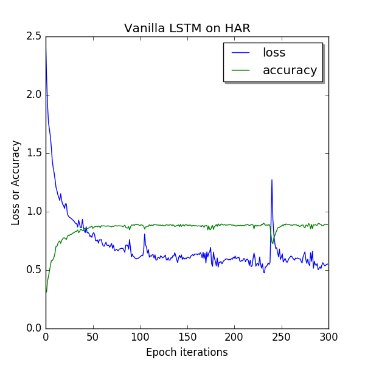
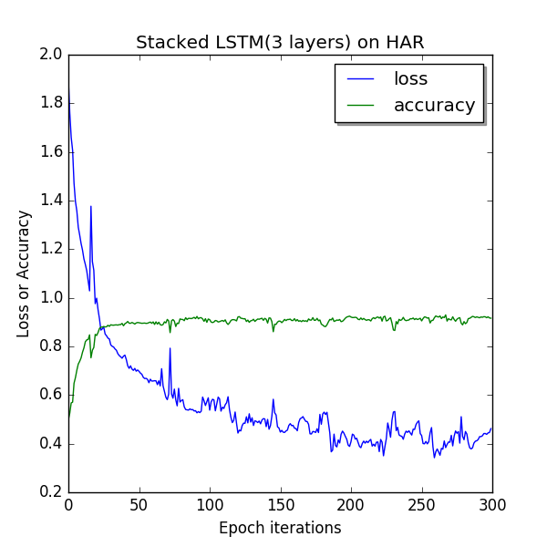
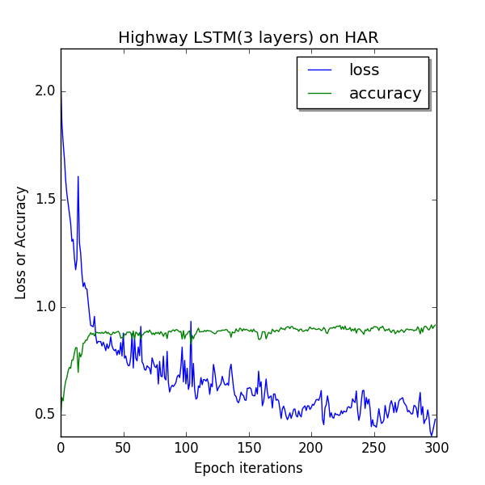
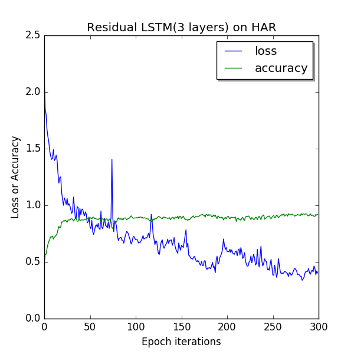
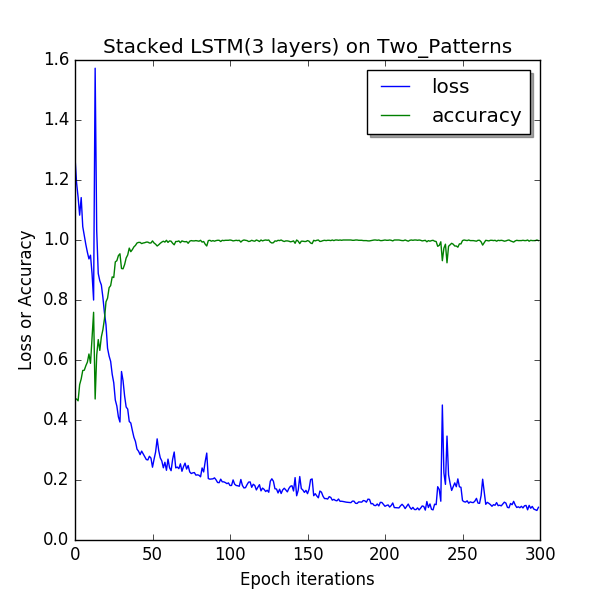
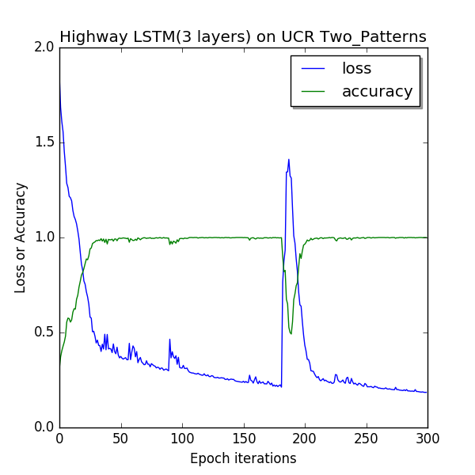
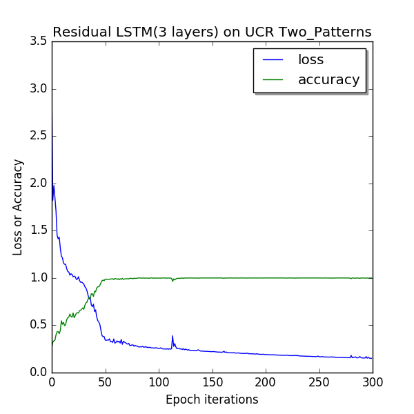

# Stacked LSTM Architecture Study on Time Series Datasets
Long short-term memory(LSTM) networks are powerful machine learning models which are cur
rently used for wide range of applications like Speech recognition, Music Composition, Human
action Recognition, Time series Prediction etc. This is made possible due to the Universal nature of
LSTM network where given enough neural units, it can properly model and compute any conven
tional computing problem, provided it has proper weight matrix.

In our study, We have stacked Layers of LSTM networks for better performance. And by taking inspirance from ConvNets for Image Classification, We mplemented Residual Connections and Highway Connections between LSTM layers. Then, We compared our models on various Datasets.

# Experiment Setup
We have used tensorflow as Deep Learning Framework and used its GPU processing facility on NVIDIA GeForce
GTX 960M Graphic card for faster parallel batch processing.

# Python Libraries Required
numpy, tensorflow, matplotlib, sklearn

# Training models and Data Handlers
main_runner.py is used for setting all hyper-parameters and running in a loop for figuring out best parameters.

classes with data_handler suffix are responsible for data input and can be configured for different datasets without altering model definition.

Also, Each model can also run by itself to test each package (BY default, HAR dataset is used)

# Model Configuraion
class DeepLSTMConfig(Config):
    def __init__(self):
        super(DeepLSTMConfig, self).__init__()
        self.train_count = len(X_train)  # 7352 training series
        self.test_data_count = len(X_test)  # 2947 testing series
        self.n_steps = len(X_train[0])  # 128 time_steps per series

        # Training
        self.learning_rate = 0.005
        self.lambda_loss_amount = 0.0015
        self.training_epochs = 300
        self.batch_size = 1500

        # LSTM structure
        self.n_inputs = len(X_train[0][0])  # == 9 Features count is of 9: three 3D sensors features over time
        self.n_hidden = 32  # nb of neurons inside the neural network
        self.n_classes = 6  # Final output classes
        self.W = {
            'hidden': tf.Variable(tf.random_normal([self.n_inputs, self.n_hidden])),
            'output': tf.Variable(tf.random_normal([self.n_hidden, self.n_classes]))
        }
        self.biases = {
            'hidden': tf.Variable(tf.random_normal([self.n_hidden], mean=1.0)),
            'output': tf.Variable(tf.random_normal([self.n_classes]))
        }
        self.keep_prob_for_dropout = 0.85
        self.bias_mean = 0.3
        self.weights_stddev = 0.2
        self.n_layers_in_highway = 0
        self.n_stacked_layers = 3
        self.batch_norm_enabled = True
        self.also_add_dropout_between_stacked_cells = False
        
        
 # Main Runner 

if __name__ == '__main__':
	run_with_config = single_layer_lstm.run_with_config
	config = single_layer_lstm.config

	for learning_rate in [0.005, 0.0025, 0.003, 0.0005]: #1, 0.0025, 0.002]:  # [0.01, 0.007, 0.001, 0.0007, 0.0001]:
		for decay in [0.9]: #[0.005, 0.01]:
			for bn_enabled in [True, False]:
				for n_stacked in [1]: #2 3 6
					for epoch_count in [200, 300, 450]:
						config.training_epochs = epoch_count
						config.tensor_board_logging_enabled = False #should be always False, log summary folder gets impacted by mulitple runs
						config.n_stacked_layers = n_stacked
						config.batch_norm_enabled = bn_enabled
						config.learning_rate = learning_rate
						config.decay = decay
						run_with_config(config) #, trX, trY, teX, teY)
						

# Plots

